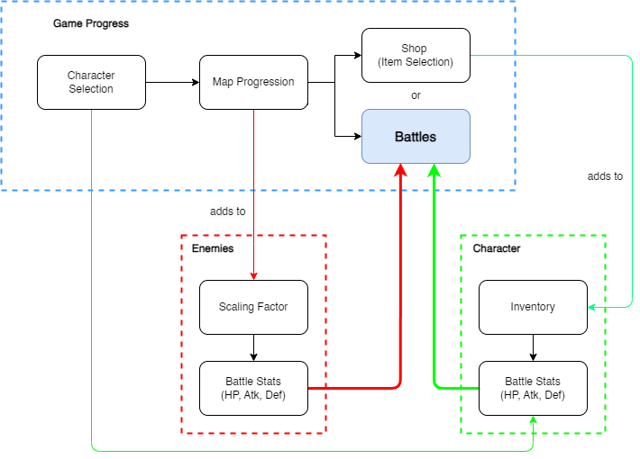

# RPG_Game

Building a browser RPG Game inspired by one of my favorite title of all time, Slay the Spire.

Game Design Philosophy
A 'roguelike' game genre focuses on replayability. Instead of building long story line with characters getting stronger over multiple hours (or tens of hours) of gameplay, roguelike games cycle lasts 20mins-1hr, with character resetting over a short game progression.

Game Mechanics

